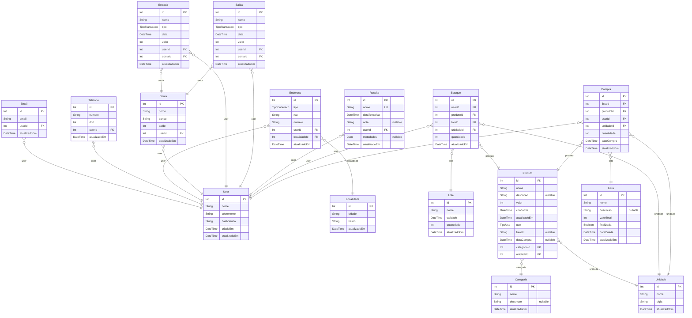

# Documentação do Banco de Dados

> Generated by [`prisma-markdown`](https://github.com/samchon/prisma-markdown)

- [default](#default)

## default

### `User`

Properties as follows:

- `id`:
- `nome`:
- `sobrenome`:
- `hashSenha`:
- `criadoEm`:
- `atualizadoEm`:

### `Email`

Properties as follows:

- `id`:
- `email`:
- `userId`:
- `atualizadoEm`:

### `Telefone`

Properties as follows:

- `id`:
- `numero`:
- `ddd`:
- `userId`:
- `atualizadoEm`:

### `Localidade`

Properties as follows:

- `id`:
- `cidade`:
- `bairro`:
- `atualizadoEm`:

### `Endereco`

Properties as follows:

- `id`:
- `tipo`:
- `rua`:
- `numero`:
- `userId`:
- `localidadeId`:
- `atualizadoEm`:

### `Conta`

Properties as follows:

- `id`:
- `nome`:
- `banco`:
- `saldo`:
- `userId`:
- `atualizadoEm`:

### `Entrada`

Properties as follows:

- `id`:
- `nome`:
- `tipo`:
- `data`:
- `valor`:
- `userId`:
- `contaId`:
- `atualizadoEm`:

### `Saida`

Properties as follows:

- `id`:
- `nome`:
- `tipo`:
- `data`:
- `valor`:
- `userId`:
- `contaId`:
- `atualizadoEm`:

### `Receita`

Properties as follows:

- `id`:
- `nome`:
- `dataTentativa`:
- `nota`:
- `userId`:
- `metadados`:
- `atualizadoEm`:

### `Unidade`

Properties as follows:

- `id`:
- `nome`:
- `sigla`:
- `atualizadoEm`:

### `Categoria`

Properties as follows:

- `id`:
- `nome`:
- `descricao`:
- `atualizadoEm`:

### `Lote`

Properties as follows:

- `id`:
- `nome`:
- `validade`:
- `quantidade`:
- `atualizadoEm`:

### `Produto`

Properties as follows:

- `id`:
- `nome`:
- `descricao`:
- `valor`:
- `criadoEm`:
- `atualizadoEm`:
- `uso`:
- `fotoUrl`:
- `dataCompra`:
- `categoriaId`:
- `unidadeId`:

### `Estoque`

Properties as follows:

- `id`:
- `userId`:
- `produtoId`:
- `loteId`:
- `unidadeId`:
- `quantidade`:
- `atualizadoEm`:

### `Lista`

Properties as follows:

- `id`:
- `nome`:
- `descricao`:
- `valorTotal`:
- `finalizada`:
- `dataCriada`:
- `atualizadoEm`:

### `Compra`

Properties as follows:

- `id`:
- `listaId`:
- `produtoId`:
- `userId`:
- `unidadeId`:
- `quantidade`:
- `dataCompra`:
- `atualizadoEm`:
